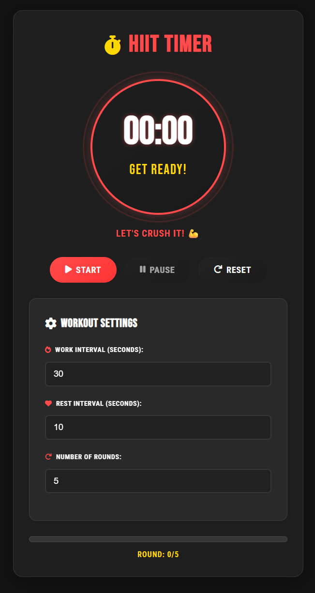

# 🏋️‍♂️ HIIT Interval Timer

A sleek and modern High-Intensity Interval Training (HIIT) timer built with vanilla HTML, CSS, and JavaScript. Perfect for workout sessions, circuit training, and any interval-based exercise routine.



## ✨ Features

- **Customizable Intervals**
  - Set work interval duration
  - Set rest interval duration
  - Configure number of rounds
  
- **Modern UI/UX**
  - Clean, sporty design
  - Circular timer display with animations
  - Progress tracking
  - Round counter
  - Responsive design for all devices

- **Audio Feedback**
  - Sound cues for work intervals
  - Sound cues for rest intervals
  - Workout completion sound

## 🚀 Getting Started

1. Clone the repository:
   ```bash
   git clone https://github.com/husnimarwan/interval-app.git
   ```

2. Open `index.html` in your web browser

That's it! No build process or dependencies required.

## 🎯 How to Use

1. **Configure Your Workout**
   - Set the work interval duration (in seconds)
   - Set the rest interval duration (in seconds)
   - Choose the number of rounds

2. **Start Your Workout**
   - Click the "Start" button to begin
   - Use "Pause" to pause the timer if needed
   - Use "Reset" to start over

3. **During the Workout**
   - The timer will count down for each interval
   - Audio cues will signal interval changes
   - Progress bar shows current interval progress
   - Round counter tracks completed rounds

## 💻 Technical Details

- Built with vanilla JavaScript - no frameworks or dependencies
- Responsive design using modern CSS
- Custom audio feedback system using Web Audio API
- Smooth animations and transitions
- Mobile-friendly interface

## 🎨 Design Features

- Dark theme with energetic accents
- Sporty typography using Bebas Neue font
- Animated timer display
- Intuitive controls
- Progress visualization
- Motivational elements

## 🌐 Browser Support

Works on all modern browsers:
- Chrome
- Firefox
- Safari
- Edge

## 📱 Mobile Support

The app is fully responsive and works great on:
- Mobile phones
- Tablets
- Desktop computers

## 📄 License

MIT License - feel free to use this project for personal or commercial purposes.

## 🤝 Contributing

Contributions are welcome! Feel free to:
1. Fork the repository
2. Create your feature branch
3. Commit your changes
4. Push to the branch
5. Open a pull request

## ✍️ Author

Created by Husni Marwan

---

Made with ❤️ for the fitness community